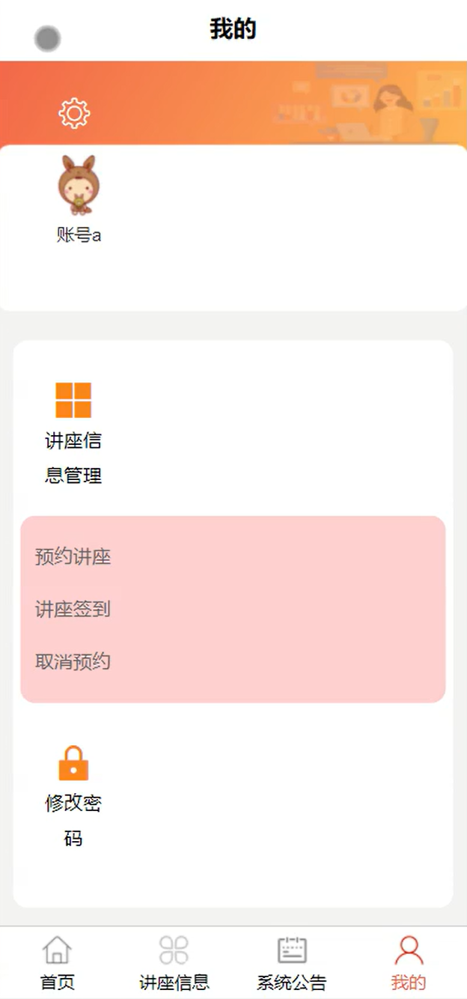

# mpweixinA220D
mpweixinA220D讲座信息管理微信小程序+LW+PPT
 
## 源码问题查看主页咨询

### 一、关键词
讲座信息，预约讲座，讲座签到

### 二、作品包含
源码+数据库+万字设计文档+PPT+全套环境和工具资源+本地部署教程

### 三、项目技术
前端技术： Html、Css、Js、Vue3.0、Element-plus
后端技术：Java、SpringBoot3.0、MyBatis

### 四、运行环境（以下版本亲测，其他版本兼容性请自行测试）
开发工具：IDEA/eclipse  + VSCODE + 微信开发者工具

数据库：MySQL5.7（最低要5.7版本）

数据库管理工具：Navicat10以上版本

环境配置软件： JDK17 + Maven3.6.3

前端Nodejs：20

浏览器：谷歌浏览器

### 五、项目介绍
项目编号：mpweixinA220D

讲座信息管理微信小程序可帮助用户便捷获取讲座信息、预约讲座及签到，实现讲座全流程的数字化管理与服务。

角色：管理员、用户

用户功能：首页、讲座信息、系统公告、我的、预约讲座、讲座签到、取消预约、修改密码。

管理员功能：首页、系统公告管理、轮播图管理、用户管理、讲座资讯管理、讲座信息管理。

### 六、运行截图

